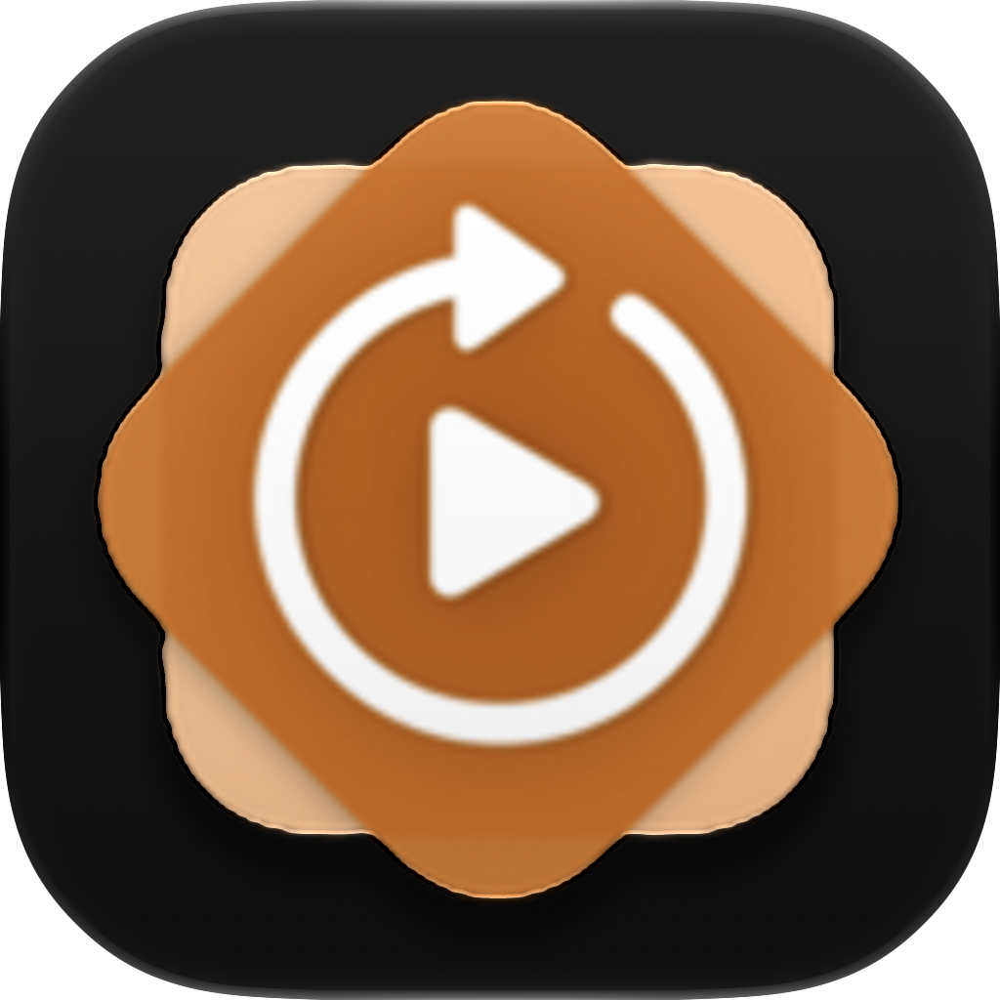

# DemoLoop

DemoLoop is a recreation of Apple DemoLoop in Swift.

Features:

- **Looping Playback**: Automatically plays a video file in a continuous loop just like the original DemoLoop.
- **Image Support**: Can also display static images (PNG, JPG, JPEG) if provided. Good for devices where you are unable to locate the original demo video.
- **Status Menu**: Includes a status menu that can be accessed by performing a 3 finger hold on iOS and iPadOS or via the right click context menu on macOS just like the original.
- **Enrollment/Unenrollment**: The status menu provides options for device enrollment and network checks just like the original. These options do not actually function, though.

# How to build DemoLoop

Prerequisites:

A Mac running macOS 26 or newer. If you can get this compiling and running on older macOS versions, let me know!

Xcode 26 or newer. If you can get this compiling and running on older Xcode versions, let me know!

An iPhone or iPad running iOS 26 or newer. If you can get this running on older iOS versions, let me know!

A video matching the resolution of the iOS device you are targeting. For example, the target resolution for the iPhone 13 and 14 is 2556 × 1179. You can find an example movie.mp4 already prepared in the 2556 × 1179 resolution in the DemoLoop folder.

## Step 1. 
Clone the repository.

## Step 2.
Open the repository in Xcode.

## Step 3.
Choose a signing team. The app will not build if you do not have a signing team.

## Step 4.
Place the video of your choice at movie.mov, or movie.mp4. Alternatively, place an image of your choice at movie.png or movie.jpeg

## Step 5.
Run the project on the device or simulator of your choosing

## Step 6
Profit! You are now done.

> [!TIP]
> # If you have any problems with this application, please leave an issue!
